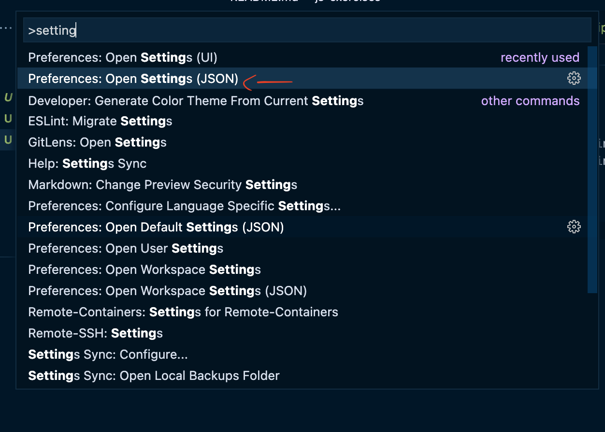
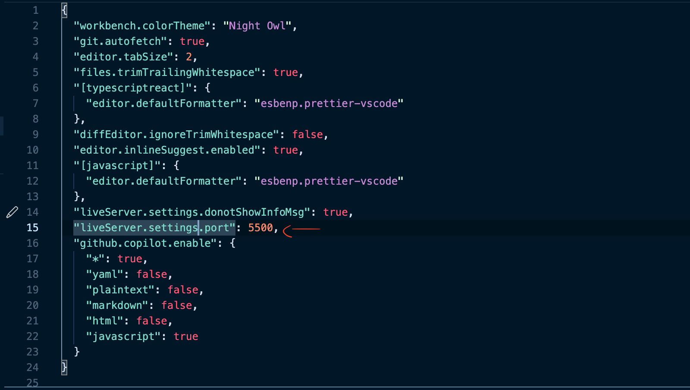

### Getting started

Install testcafe via: `yarn add global testcafe`

VSCode live server extension uses a random port if not specified in settings.
We want to have a consistent port to use for this exercise and others using testcafe.

To use port 5500 with live server extension:

1. Open VSCode settings.json with `cmd+shift+p`
2. Search `settings`
3. Select `Open Settings (JSON)`

4. Add this line: `"liveServer.settings.port": 5500,`

5. Click the `Go live` button in the status bar on the bottom-right.

Be sure to close the server and reopen it for other exercises!

### 4 - Testcafe - Dom Manipulation Exercise

1. Add test to check if button is green and text is 'Clicked' after clicking button
2. Run the test `testcafe chrome ./4_testcafeDomManipulation/domManipulation.test.js`