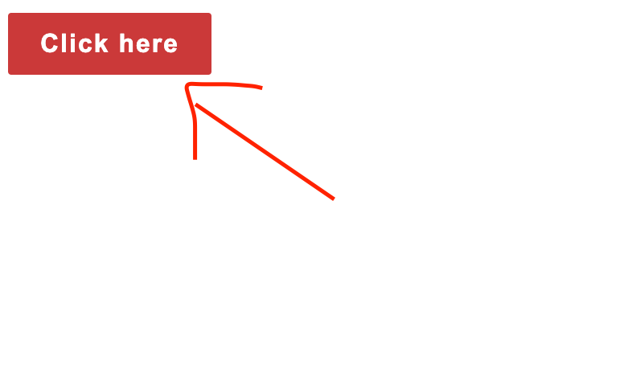
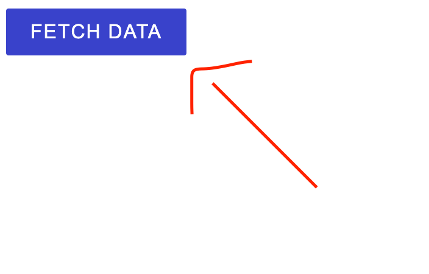

## Javascript Exercises

### Getting started

run `yarn install`

For exercise 2 & 3, to serve the HTML page and javascript I recommend installing the [VSCode Live Server extension](https://marketplace.visualstudio.com/items?itemName=ritwickdey.LiveServer) then:

1. Open the html file


2. Click `Go Live`


### 1 - toArray

Write a function that converts an object into an array, where each element represents a key-value pair in the form of an array.

Example:
```
toArray({ a: 1, b: 2 }) ➞ [["a", 1], ["b", 2]]

toArray({ shrimp: 15, tots: 12 }) ➞ [["shrimp", 15], ["tots", 12]]

toArray({}) ➞ []

```

To test solution, run `yarn test`

### 2 - DOM Manipulation

When the button below is clicked, change it's color to any shade of green and update the button's text to say "Clicked".



### 3 - Using fetch

When the button below is clicked, make an AJAX request using Fetch to the url below and console.log the data to the browser.

`https://jsonplaceholder.typicode.com/posts/1`


